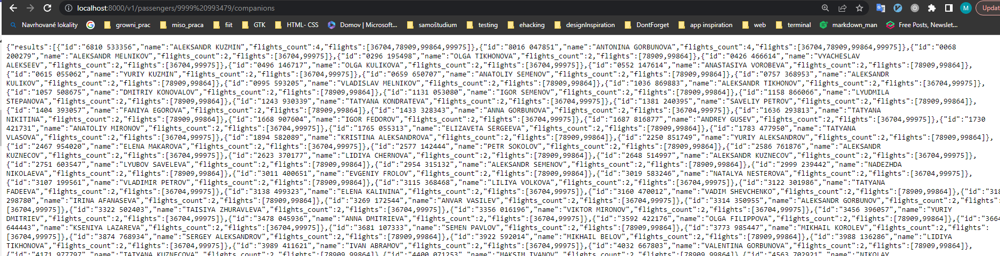
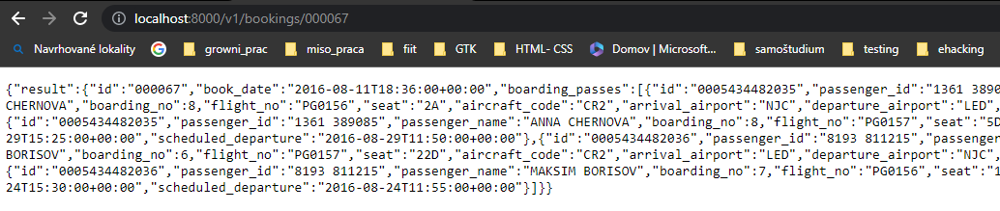
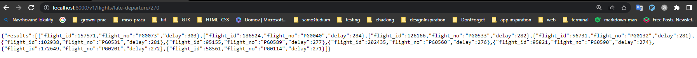
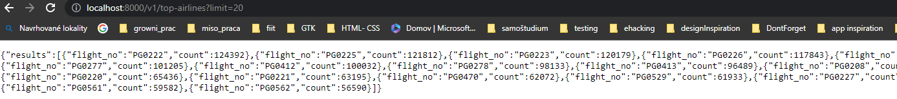
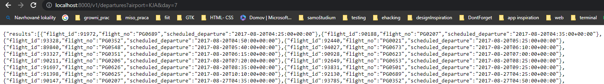
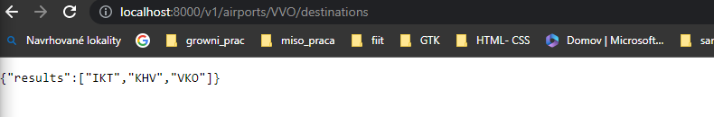
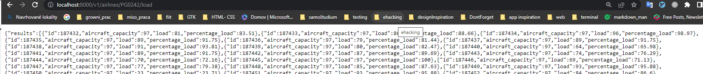
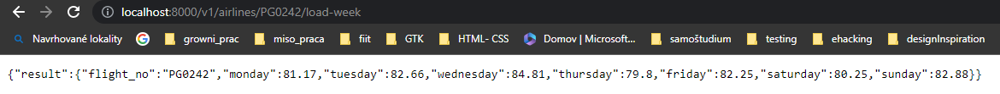

# Druhe zadanie z DBS

**Cislo commitu: c65076c**

## Vypracované a popísane query

### Endpoint -zoznam spolucestujúcich (1b)
**SQL Cast**
*QUERY* 
```   
    SELECT  bookings.tickets.passenger_id AS id,  
    bookings.tickets.passenger_name AS name, 
    count(bookings.tickets.passenger_name)::int AS flights_count, 
    ARRAY_AGG(bookings.ticket_flights.flight_id ORDER BY bookings.ticket_flights.flight_id ASC) as flights  
    FROM bookings.tickets 
        JOIN bookings.ticket_flights ON bookings.tickets.ticket_no = bookings.ticket_flights.ticket_no WHERE bookings.ticket_flights.flight_id = ANY
        (
            SELECT flight_id FROM bookings.tickets
            JOIN bookings.ticket_flights ON bookings.tickets.ticket_no = bookings.ticket_flights.ticket_no
            WHERE passenger_id=$1::text ORDER BY passenger_id ASC

        ) AND  bookings.tickets.passenger_id <> $1
    GROUP BY passenger_id, passenger_name ORDER BY flights_count DESC, bookings.tickets.passenger_id ASC;
```

*Popis*

- vnutorný SELECT slúži na nájdenie všetkých IDčiek letov ktorých sa pasazier s IDčkom z url zúčastnil
- následne spojím tabuľky na základe podmienky `bookings.ticket_flights ON bookings.tickets.ticket_no = bookings.ticket_flights.ticket_no WHERE bookings.ticket_flights.flight_id = ANY (LETY KTORE ABSOLBOVAL PASAZIER)` 
- kľúčové slovo ANY používam pretože vnútorný SELECT vracia viacej ako jeden riadok
- takže záznam bude z vnútorného SELECTU pridaný do výslednej tabuľky ak sa rovná aspoň jednému z výsledkov pre vnútorný SELECT
- `AND  bookings.tickets.passenger_id <> $1` týmto pravidlom zabezpečím aby sa vo výslednej tabuľke nezobrazil pasažier s idčkom z URL
- $1 predstavuje IDčko pasažiera vytiahnutej z URL

**Implementačná časť**

*Príklad volania endPointu*<br>
<br>


*Implementacia*
```
@Get('v1/passengers/:passengerID/companions')
  async getFlightCompanion(@Param() params: object): Promise<any> {

    let companions: any

    companions = await this.databaseService.getTravelCompanions(params["passengerID"]);

    return companions;

}
```

---

### Endpoint -detail letu(0,5b)
**SQL Časť**
*QUERY*

```
    SELECT book_info.book_ref as id, 
        to_char(book_info.book_date AT TIME ZONE 'UTC', 'YYYY-MM-DD"T"HH24:MI:SS+00:00') AS book_date, 
    json_agg(json_build_object(
        'id', tick_flights.ticket_no,
        'passenger_id', passanger_info.passenger_id,
        'passenger_name', passanger_info.passenger_name,
        'boarding_no', passes_info.boarding_no,
        'flight_no', flights_info.flight_no,
        'seat', passes_info.seat_no,
        'aircraft_code', flights_info.aircraft_code,
        'arrival_airport', flights_info.arrival_airport,
        'departure_airport', flights_info.departure_airport,
        'scheduled_arrival', flights_info.scheduled_arrival,
        'scheduled_departure', flights_info.scheduled_departure
        )     
        ORDER BY tick_flights.ticket_no ASC, passes_info.boarding_no ASC) AS boarding_passes 
        FROM bookings.boarding_passes as passes_info
            JOIN (SELECT ticket_no, flight_id FROM bookings.ticket_flights) as tick_flights ON tick_flights.ticket_no = passes_info.ticket_no AND tick_flights.flight_id = passes_info.flight_id
            JOIN (SELECT flight_id, flight_no, aircraft_code, arrival_airport, departure_airport, scheduled_arrival, scheduled_departure FROM bookings.flights) AS flights_info ON flights_info.flight_id = tick_flights.flight_id
            JOIN (SELECT book_ref, ticket_no, passenger_id, passenger_name FROM bookings.tickets) AS passanger_info ON passanger_info.ticket_no = tick_flights.ticket_no
            JOIN (SELECT book_ref, book_date FROM bookings.bookings) AS book_info ON book_info.book_ref = passanger_info.book_ref
        WHERE book_info.book_ref = $1
        GROUP BY book_info.book_ref, book_info.book_date;
```

*Popis*

- Pri tejto Query bolo potrebné správne spájať tabuľky 
- Tabuľky som začal postupne spájať od počiatočnej tabuľky boarding_passes 
- najskôr som spojil tabuľky boarding_passes s tabuľkou ticket_flights podla klúčov ticket_no a flight_id
- takto som spájal tabuľky podľa klúčov tak ako sú v schéme 
- keď už som mal všetky potrebné tabuľky a z nich potrebné údaje výslednú tabuľku som obmedzil pravidlom `WHERE book_info.book_ref = $1` ktoré zabezbečí že vo výsledku bude len riadkok z ktorého aspoň jeden stĺpec spĺňa podmienku
- $1 predstavuje hodnotu rezervácie vytiahnutej z URL

**Implementačná časť**

*Príklad volania endPointu*<br>


*Implementacia*
```
  @Get('/v1/bookings/:bookingId')
  async getDetailFlight(@Param() params: object): Promise<any> {

    let detail: any
    //coment len aby bolodobre

    detail = await this.databaseService.detailedFlightInfo(params["bookingId"])

    return detail;

  }
```

---

### Endpoint -neskoré odlety(0,5b)
**SQL Časť**
*QUERY*
```
SELECT
    flight_id,
    flight_no,
    (EXTRACT (EPOCH FROM (actual_departure - scheduled_departure)) / 60 )::integer AS delay
    FROM bookings.flights WHERE (EXTRACT (EPOCH FROM (actual_departure - scheduled_departure)) / 60 ) >= $1 ORDER BY delay DESC;
```

*Popis*
- v tejto Query používam stĺpce len z jednej tabuľky
- odčítam od seba dátum aktuálneho odchodu a  plánovaného odchodu vydelím 60 = predstavuje meškanie v minútach
- následne výsledné záznamy obmedzím pravidlom `WHERE (EXTRACT (EPOCH FROM (actual_departure - scheduled_departure)) / 60 ) >= $1` ktoré zabezpečí aby sa vo výslednej tabuľke zobrazili riadky ktoré spĺňajú že meškanie v minútach je vačšie alebo rovné ako zadané
- $1 predstavuje meškanie v minútach z URL

**Implementačná časť**

*Príklad volania endPointu*<br>


*Implementacia*
```
@Get('v1/flights/late-departure/:delay')
  async getDelayedFlights(@Param() params: object) {

    let delayedFlights: any

    delayedFlights = await this.databaseService.getDelayedFlights(params["delay"]);

    return delayedFlights;
}
```
---

### Endpoint -Linky, ktoré obslúžili najviac pasažierov(0,5b)
**SQL Časť**
*QUERY*

```
    SELECT flight_no, 
    count(bookings.ticket_flights.flight_id)::int  AS count 
    FROM bookings.ticket_flights 
    JOIN (SELECT flight_no, flight_id, actual_departure, status FROM bookings.flights 
    WHERE status = 'Arrived') as number_records ON number_records.flight_id = bookings.ticket_flights.flight_id
    WHERE actual_departure IS NOT NULL  
    GROUP BY flight_no 
    ORDER BY count DESC LIMIT $1;
```

*Popis*

- Spojím tabuľky flights a ticket_flights pomocou klúča flight_id nakoľko obsahujú dáta s ktorými chcem pracovať
- v JOINE odfiltrujem len lety ktoré spĺňajú status Arrived nakoľko to znamená že pristáli na letisku na ktorom mali
- následne záznamy obmedzím pomocou ` WHERE actual_departure IS NOT NULL` tým sa si poistím že lietadlo naozaj odletelo nakoľko má nastavený čas odletu
- následne výpis groupnem podľa flight_number a spočítam koľko máme rovnakých flight_id
- ako posledné počet riadkov obmedzím `LIMIT $1` na počet zadaný z URL

**Implementačná časť**

*Príklad volania endPointu*<br>


*Implementacia*
```
@Get('v1/top-airlines')
  async getMaxLinkPassenger(@Query('limit') limit: string) {

    let maxPassangerLink: any

    maxPassangerLink = await this.databaseService.maxLinkPassanger(limit);

    return maxPassangerLink;
  }
```

---

### Endpoint –naplánované linky (0,5b)
**SQL Časť**
*QUERY*
```
SELECT flight_id, 
    flight_no,  
    to_char(scheduled_departure AT TIME ZONE 'UTC', 'YYYY-MM-DD"T"HH24:MI:SS+00:00') AS scheduled_departure
FROM bookings.flights
WHERE  actual_departure is NULL AND (EXTRACT('ISODOW' FROM scheduled_departure)) = $1 AND flights.departure_airport = $2
ORDER BY scheduled_departure ASC , flight_id;
```

*Popis*

- V tejto úlohe pracujem len s tabuľkou flights 
- následne kontrolujem či lietadlo má pre aktuálny odlet hodnotu NULL čo predstavuje let ktorý ešte neodletel ale je naplánovaný
- ďalej v podmienkach kontrolujem či sedí deň ktorý extrahujem z plánovaného odletu a názov letiska z ktorého lietadlo odlieta
- $1 predstavuje deň extrahovaný z URL
- $2 predstavuje názov letiska extrahovaného z URL

**Implementačná časť**

*Príklad volania endPointu*<br>


*Implementacia*
```
 @Get('v1/departures')
  async getPlannedLink(@Query('airport') airport: string, @Query('day') day: string) {

    let plannedLinks: any

    plannedLinks = await this.databaseService.plannedLink(day, airport);

    return plannedLinks;
  }
```

---

### Endpoint -Vypíšte všetky destinácie zo zadaného letiska(0,5b)
**SQL Časť**
*QUERY*
```
SELECT json_agg(result.arrival_airport) as results  FROM (SELECT DISTINCT arrival_airport FROM bookings.flights WHERE departure_airport = $1 GROUP BY arrival_airport ORDER BY  arrival_airport ASC) AS result;
```

*Popis*

- v tejto query využijem vnorený SELECT v FROM
- vo vnútornom SELECTE  obmedzím a pomocou klúčového slova DISTINCT zabezpečím aby sa mi zobrazili riadky pre cieľové letisko bez duplicít ktoré obsahujú stĺpec štartovacie letisko ktoré sa zhoduje so zadaným letiskom
- ako posledný krok výsledné letiská funkciou `json_agg(result.arrival_airport)` vložím do json objektu
- $1 predstavuje cieľové letisko vytiahnuté z URL

**Implementačná časť**

*Príklad volania endPointu*<br>


*Implementacia*
```
  @Get('v1/airports/:airport/destinations')
  async getDestinationFromAirports(@Param() params: object) {

    let destinations: any

    destinations = await this.databaseService.destinationAirport(params["airport"]);

    return destinations;
  }
```

---

### Endpoint –vyťaženosť letov pre konkrétnu linku(1b)
**SQL Časť**
*QUERY*
```
SELECT bookings.ticket_flights.flight_id AS id, 
    seats_capacity.aircraft_capacity,  
    COUNT(ticket_flights.flight_id)::int as load, 
    ROUND((COUNT(ticket_flights.flight_id)::float/seats_capacity.aircraft_capacity::float *100)::numeric, 2)::float AS percentage_load 
FROM
    bookings.ticket_flights
    JOIN 
        (SELECT flight_id, aircraft_code, flight_no FROM bookings.flights WHERE flight_no = $1) AS flightsCode ON ticket_flights.flight_id = flightsCode.flight_id
    JOIN 
        (SELECT aircrafts_data.aircraft_code, COUNT(seats.aircraft_code)::int AS aircraft_capacity FROM bookings.seats
    JOIN 
        bookings.aircrafts_data ON seats.aircraft_code = aircrafts_data.aircraft_code GROUP BY seats.aircraft_code, aircrafts_data.aircraft_code) AS seats_capacity ON flightsCode.aircraft_code = seats_capacity.aircraft_code
GROUP BY ticket_flights.flight_id, seats_capacity.aircraft_capacity ORDER BY ticket_flights.flight_id ASC;
```

*Popis*

- pomocou tabuliek aircrafts_data a seats si zistím aký počet sedadiel majú jednotlivé typy lietadla
- v tabuľke flights odfiltrujem len idčka lietadiel ktoré majú rovnaké čislo linky aká bola zadaná zo vstupu
- spojím tabuľky ticket_flights, flights a spojenie tabuliek aircrafts_data a seats, flights a aircrafts_data a seats spojím len s aircraft_code ktoré majú lietadlá ktoré patria do zadanej linky
- následne pomocou vzorca ((pocet rovnakých Idcok lietadiel v tiket_flights = počet pasažierov v lietadle)/kapacita lietadla) * 100 vypočítam vytaženie pre špecifické id letu 
- $1 predstavuje číslo linky zadanej v URL

**Implementačná časť**

*Príklad volania endPointu*<br>


*Implementacia*
```
  @Get('v1/airlines/:flight_no/load')
  async getLoadForSpecLink(@Param() params: object) {

    let load: any

    load = await this.databaseService.loadSpecificLink(params["flight_no"]);

    return load;
  }
```

---

### Priemerná vyťaženosťlinky pre jednotlivé dni vtýždni(0,5b)
**SQL Časť**
*QUERY*
```
SELECT
    json_build_object(
        'flight_no',  flights.flight_no,
        'monday', ROUND(AVG(CASE WHEN EXTRACT(ISODOW FROM flights.scheduled_departure) = 1 THEN percentage_load END), 2),
        'tuesday', ROUND(AVG(CASE WHEN EXTRACT(ISODOW FROM flights.scheduled_departure) = 2 THEN percentage_load+0.01 END), 2),
        'wednesday', ROUND(AVG(CASE WHEN EXTRACT(ISODOW FROM flights.scheduled_departure) = 3 THEN percentage_load END), 2),
        'thursday', ROUND(AVG(CASE WHEN EXTRACT(ISODOW FROM flights.scheduled_departure) = 4 THEN percentage_load END), 2),
        'friday', ROUND(AVG(CASE WHEN EXTRACT(ISODOW FROM flights.scheduled_departure) = 5 THEN percentage_load END), 2),
        'saturday', ROUND(AVG(CASE WHEN EXTRACT(ISODOW FROM flights.scheduled_departure) = 6 THEN percentage_load END), 2),
        'sunday', ROUND(AVG(CASE WHEN EXTRACT(ISODOW FROM flights.scheduled_departure) = 7 THEN percentage_load END), 2)
    ) as result
FROM (
    SELECT
        flights.flight_no,
        flights.scheduled_departure,
        round(((count(ticket_flights.flight_id)::float / count_seats.aircraft_capacity::float)::float * 100)::numeric, 2) as percentage_load
    FROM bookings.flights
    JOIN (
        SELECT
            air_data.aircraft_code,
            COUNT(seats.aircraft_code) AS aircraft_capacity
        FROM bookings.seats AS seats
        JOIN bookings.aircrafts_data AS air_data ON seats.aircraft_code = air_data.aircraft_code
        GROUP BY seats.aircraft_code, air_data.aircraft_code
    ) AS count_seats ON bookings.flights.aircraft_code = count_seats.aircraft_code
    JOIN bookings.ticket_flights ON flights.flight_id = ticket_flights.flight_id
    WHERE flights.flight_no = $1
    GROUP BY flights.flight_id, flights.flight_no, flights.scheduled_departure, count_seats.aircraft_capacity
) as flights
GROUP BY flights.flight_no;
```
*Popis*

- v tomto SELECTE som využil Query pre priemernú vyťaženosť linky ktorú som umiestnil do FROM() keyword
- celá logika je skrytá vo funkcií json_build_object kde kontrolujem či záznam mal naplánovaný odlet v daný deň a ak áno tak túto hodnotu prídam do funkcie AVG ktorá mi nasumuje všekty pridané záznamy a vytvorí z nich priemer
**Implementačná časť**

*Príklad volania endPointu*<br>


*Implementacia*
```
  @Get('/v1/airlines/:flightNo/load-week')
  async getStatisticOfWeek(@Param() params: object) {

    let plannedLinks: any

    plannedLinks = await this.databaseService.statisticForWeek(params["flightNo"])

    return plannedLinks;
  }

```

---

> Made with love, Matúš Makay 

