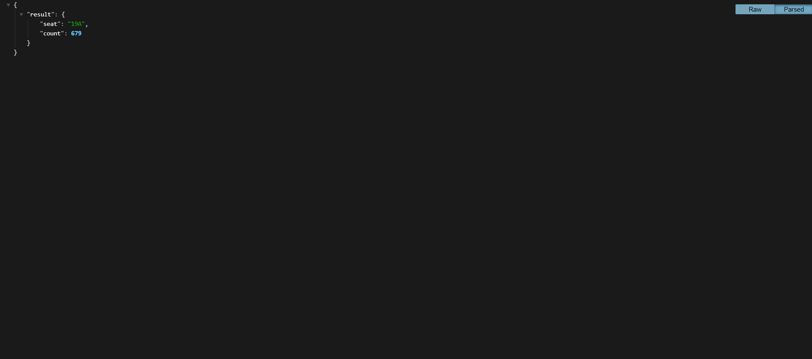
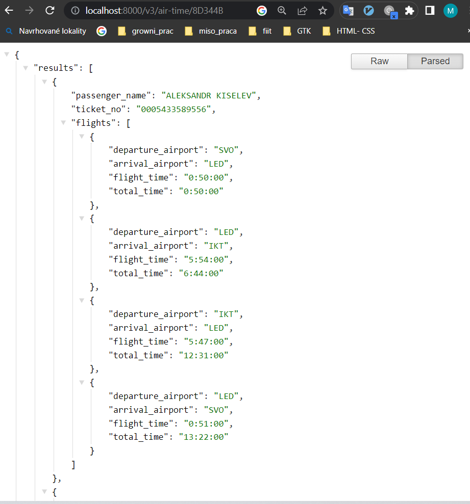
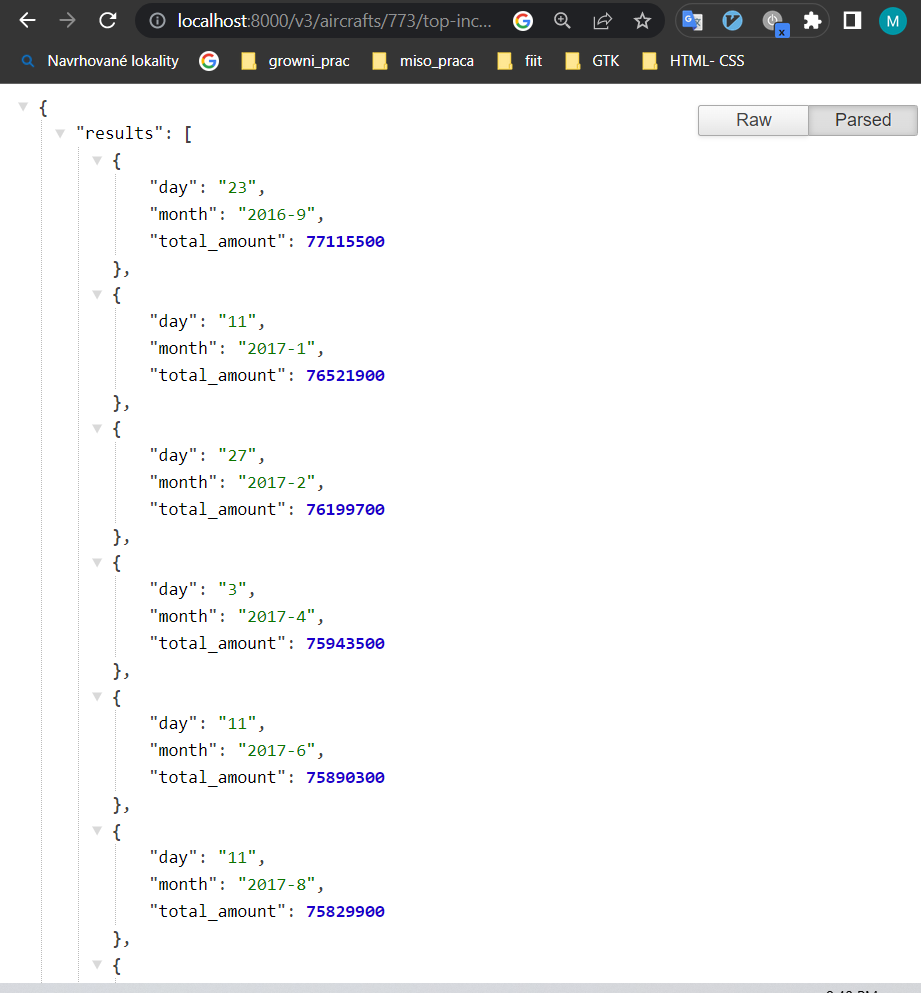

# Tretie zadanie z DBS

<style type="text/css">
  body{
  font-size: 15pt;
}
h1{
    font-size: 18pt;
}
h2{
    font-size: 17pt;
}
h2{
    font-size: 16pt;
}
</style>


**Cislo commitu: db7d526**


## Vypracované a popísane query

### Endpoint 1 - (2b)
**SQL Cast** <br>

*QUERY* 

```   
SELECT
    rankSeatsSelect.seat_no as seat,
    count(rankSeatsSelect.ran)::int as count
FROM
    (
        SELECT
            dense_rank() OVER(partition by filter_flights.flight_id ORDER BY book_date) as ran,
            seat_no
        FROM
            (
                SELECT
                    seat_no,
                    tf.ticket_no,
                    fl.flight_id
                FROM bookings.boarding_passes as bp
                    JOIN (SELECT ticket_no, flight_id FROM bookings.ticket_flights) AS tf ON tf.flight_id = bp.flight_id and tf.ticket_no = bp.ticket_no
                    JOIN (SELECT aircraft_code, flight_id FROM bookings.flights) as fl ON fl.flight_id = tf.flight_id
                WHERE fl.aircraft_code = $1
            ) as filter_flights
        JOIN (SELECT book_ref, ticket_no FROM bookings.tickets) as tc on tc.ticket_no = filter_flights.ticket_no
        JOIN (SELECT book_date, book_ref FROM bookings.bookings) as bk ON bk.book_ref = tc.book_ref
    ) as rankSeatsSelect
WHERE rankSeatsSelect.ran = $2
GROUP BY rankSeatsSelect.seat_no
order by count DESC
LIMIT 1;
```

*Popis*
- pomocou filter_flights selectu si odfiltrujem záznamy len konkrétny typ lietadla zo spojenia tabuliek boarding_passes, ticket_flight a flights
- následne si join-em tabuľky tickets a bookings tým získam všetky potrebné záznamy
- ďalej si zgrupím záznamy podľa ID letu a túto gropu zoradím podľa toho kedy bol booking vytvoreny 
- nad týmito grupami použijem operáciu dense_rank ktorá mi ohodnotí riadky podla toho ako vznikli
- ako posledné si odfiltrujem len tie záznami ktoré boli vytvorené k-te v poradi
- zgrupim si záznamy podľa čísla sedadla a spočítam kolko krat sa pre sedadlo vyskytuje číslo z dense_rank-u

**Implementačná časť**

*Príklad volania endPointu*<br>
<br>


*Implementacia*
```
 @Get('/v3/aircrafts/:aircraftCode/seats/:seatChoice')
  async getKorderForSeat(@Param() params: object) {

    let orderedSeats: any

    orderedSeats = await this.databaseService.orderStatisticForSeat(params["aircraftCode"], params["seatChoice"])

    return orderedSeats;

  }
```
### Endpoint 2 - (2b)
**SQL Cast**<br>
*QUERY* 
```   
SELECT
    innerSelect.ticket_no,
    innerSelect.passenger_name,
    json_build_object(
        'departure_airport', innerSelect.departure_airport,
        'arrival_airport', innerSelect.arrival_airport,
        'flight_time', regexp_replace(innerSelect.flight_time, '^0', ''),
        'total_time', regexp_replace(to_char(innerSelect.total_time_wrong_format, 'HH24:MI:SS'), '^0', '')
    ) as flights
FROM
    (
        SELECT
            bp.ticket_no,
            tc.passenger_name,
            departure_airport,
            arrival_airport,
            flight_time,
            SUM(substraction) OVER (PARTITION BY passenger_name ORDER BY actual_departure ROWS BETWEEN UNBOUNDED PRECEDING AND CURRENT ROW) as total_time_wrong_format
        FROM bookings.boarding_passes as bp
            JOIN (SELECT ticket_no, flight_id FROM bookings.ticket_flights) AS tf ON tf.flight_id = bp.flight_id and tf.ticket_no = bp.ticket_no
            JOIN (SELECT aircraft_code, flight_id, actual_departure, actual_arrival, to_char((actual_arrival - actual_departure), 'HH24:MI:SS') as flight_time,(actual_arrival - actual_departure) as substraction,  departure_airport, arrival_airport FROM bookings.flights) as fl ON fl.flight_id = tf.flight_id
            JOIN (SELECT book_ref, ticket_no, passenger_name FROM bookings.tickets) as tc on tc.ticket_no = tf.ticket_no
            JOIN (SELECT book_date, book_ref FROM bookings.bookings) as bk ON bk.book_ref = tc.book_ref
        WHERE bk.book_ref = $1 and fl.actual_arrival IS NOT NULL and fl.actual_departure IS NOT NULL
    ) as innerSelect
ORDER BY innerSelect.ticket_no ASC
```

*Popis*
- v tomto selecte si najskôr spojím všetky tabuľky ktoré potrebujem a to sú boarding_passes, ticket_flights, flights, tickets, bookings
- následne záznamy odfiltrujem len na tie ktoré majú rovnaký book_ref ako ten zo vstupu a ktoré naozaj odleteli čiže majú nastavené atributy actual_departure a actual_arrival
- nasledne si záznamy zgrupím do okien podľa mena záznamy zoradím podla aktuálneho odletu tak ako je napísané v zadaní a následne v danom okne pre každý záznam vypočítam sumu pre aktuálny riadok a všetky predchádzajúce 
- vrchý select je len štýlovací ktorý zabezpečuje ľahkú prácu s dátami na serveri


**Implementačná časť**

*Príklad volania endPointu*<br>
<br>


*Implementacia*
```
 @Get('/v3/air-time/:bookRef')
  async getAirTime(@Param() params: object) {

    let timeInAir: any

    timeInAir = await this.databaseService.timeInAir(params["bookRef"])

    return timeInAir;
  }
```

### Endpoint 4 - (2b)
**SQL Cast**<br>
*QUERY* 
```   
SELECT
    lastSelect.day,
    lastSelect.month,
    lastSelect.total_amount::int
FROM
    (
        SELECT
            outerSelect.month,
            outerSelect.total_amount,
            outerSelect.day,
            MAX(total_amount) OVER (PARTITION BY outerSelect.month ROWS BETWEEN UNBOUNDED PRECEDING AND UNBOUNDED FOLLOWING) AS max
        FROM
            (
                SELECT
                    innerSelect.month,
                    innerSelect.day,
                    total_amount
                FROM
                    (
                        SELECT
                          fl.month,
                          fl.day,
                          SUM(amount) OVER (PARTITION BY fl.month, fl.day) AS total_amount
                        FROM bookings.ticket_flights as tf
                          JOIN (SELECT aircraft_code, flight_id, actual_departure, EXTRACT(DAY FROM actual_departure) AS day, to_char(actual_departure, 'YYYY-FMMM') as month  FROM bookings.flights) AS fl ON fl.flight_id = tf.flight_id
                        WHERE aircraft_code = $1 AND actual_departure IS NOT NULL
                    ) AS innerSelect
                GROUP BY innerSelect.month, innerSelect.day, total_amount
            ) AS outerSelect
    ) AS lastSelect
WHERE lastSelect.total_amount = lastSelect.max
ORDER BY lastSelect.total_amount DESC
```

*Popis*
- toto query sa skladá zo štyroch selectov 
- vnútorný select slúzi na odfiltrovanie len potrebných záznamov a vytvorenie súčtu pre každý deň ktorý sa nachádza v záznamoch
- ako daľšie si zgrupím vnútorný select aby sa mi každý deň v záznamoch vyskytoval len raz
- v daľšom selecte si zgrupim zaznamy podľa mesiaca a roka a nájdem maximálnu hodnotu pre jeden konkrétny deň v mesiaci  ktorú pridám do každého záznamu toto budem ďalej využívať
- v poslednom selecte si odfiltrujem a zobrazím len tie záznamy ktorých daily_amount je rovnaké ako max

**Implementačná časť**

*Príklad volania endPointu*<br>
<br>


*Implementacia*
```
 @Get('/v3/aircrafts/:aircraftCode/top-incomes')
  async getMaxProfitDay(@Param() params: object) {

    let maxProfitDays: any

    maxProfitDays = await this.databaseService.profitDays(params["aircraftCode"])

    return maxProfitDays
}
```